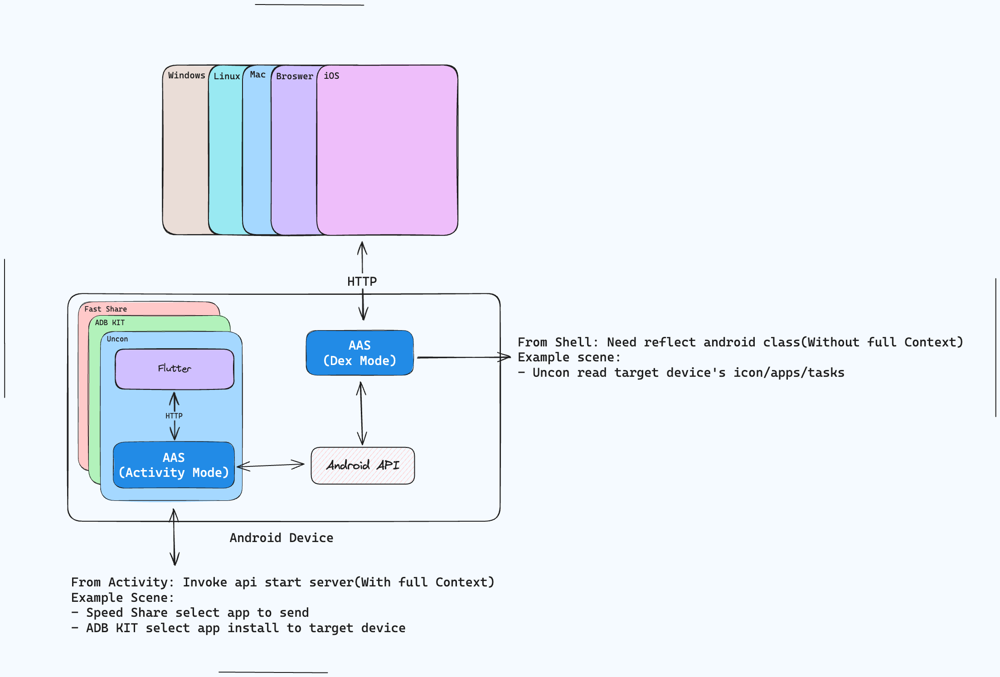
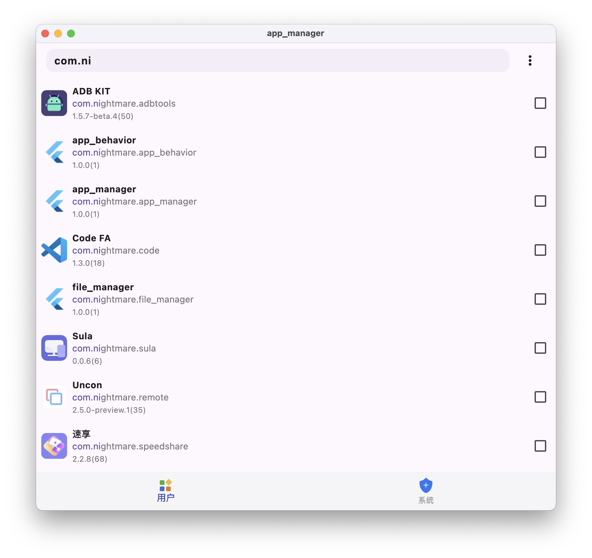

## Android API Server(AAS)
[](https://jitpack.io/#nightmare-space/android_api_server)

AAS 是一个为 Android 设备提供 RESTful API 的服务器。它基于 HTTP 协议，可以被任何支持 HTTP 的客户端访问。它设计轻量且易于使用，支持热插拔，你可以通过很简短的代码，来让 AAS 加载你自定义的插件

支持上层框架为 Web 或者 Flutter 或者其他任意不能直接访问 Java 的框架中使用

例如在 Flutter 中，我们几乎需要使用 MethodChannel 来访问安卓的 API

使用 MethodChannel 实现后，无法支持在 Flutter Web 中访问安卓的 MethodChannel

AAS 提供了封装好的开箱即用的 [Flutter Plugin](https://github.com/nightmare-space/android_api_server_flutter)，或者你可以根据 [API.md](docs/API.md) 实现任意语言编写的客户端

## 功能特性

- RESTful: 通过 HTTP 协议，获取安卓 API 相关的信息
- 插件化: 通过简单的代码编写，可实现自定义插件的支持
- 内置 API: 内置开箱即用的在 Dex 中获取 Context、Services 的各种 API
- 内置插件: 内置多个插件，例如获取应用列表、应用图标、创建虚拟显示器等
- Flutter Plugin 支持: 只需要引入 Flutter 依赖，AAS 会随插件的注册而启动，在 Flutter 侧只需要调用 Dart API 即可
- 多种模式支持: 支持 Activity Mode 与 Dex Mode
- 安全: 有一个简单的鉴权，来防止端口扫描恶意调用

## 架构图



对上层的应用来说，只有 Address 和 Port 的感知，它不在乎对方是哪种模式运行的

你可以在任何地方，任何设备上，通过 HTTP 获取安卓的信息

由于 HTTP 并不安全，所以 AAS 内置了一个简单的接口鉴权，来防止端口扫描恶意调用

## 开始使用

AAS 有两种运行模式

### Activity Mode

这种情况下，AAS 拥有真实的 Activity Context，对于获取应用列表，同普通安卓本身访问 API一样，需要申请权限

但基于 Restful API 的好处是，你可以通过这样的代码来获取一个 App 的图标(Flutter)

```dart
AASClient aasClient = AASClient();
Image.network(aasClient.iconUrl('com.nightmare'))
```

AASClient 是多实例，所有的 API 被封装到 AASClient 下

多实例可以让同一个页面加载不同设备的信息，例如 Uncon


## Dex Mode

启动脚本在 [auto.sh](scripts/auto.sh)

这种模式，会先将 java 编译成 class，再由 dx 或 d8 工具转换成 dex 文件

通过 adb 运行 app_process 启动 dex

这种模式带来的好处是，我们能使用的权限更多，例如获取后台任务缩略图，创建虚拟显示器(带 Group 的)

所有 java 的权限为 shell(uid 2000)，你无需再为获取应用列表，创建虚拟显示器等单独申请权限

我们可以通过为连接到 PC 的设备启动这个服务，再通过 adb forward 获得通信的端口(auto.sh 中带有端口转发)

接下来，你仍然只需要像这样就获得 App的图标

```dart
AASClient aasClient = AASClient(port: port);
Image.network(aasClient.iconUrl('com.nightmare'))
```

你还可以自己实现各种各样的 API ，来获得远超 adb 命令行的功能，例如图标，后台应用截图，adb 命令本身不支持

### 在 Flutter 中使用

提供 `android_api_server_client` 来快速的让 Flutter App 拥有这个能力，无需手动启动服务，`AAS` 随 Flutter Plugin 注册而启动，直接创建 `AASClient` 则会使用 Flutter Plugin 中启动的端口

```yaml
dependencies:
  android_api_server_client:
    git: https://github.com/nightmare-space/android_api_server_client
```
然后直接使用封装好的 Dart API
```dart
AASClient aasClient = AASClient();
AppInfos infos = await aasClient.getAppInfos();
```

如果你需要在 PC 上访问同样的接口，通过 Dex Mode，你只需要更改端口
```dart
AASClient aasClient = AASClient(port: 15000);
AppInfos infos = await aasClient.getAppInfos();
```

假如我目前有一个 Flutter 编写的展示应用列表的界面是这样


现在我想这个界面在 PC 上展示，亦或者在 Web 中展示

启动 Dex 后，我只需要修改端口号即可

```dart
AASClient aasClient = AASClient(port: Platform.isMacOS ? 15000 : null);
```



实际上，这样的模式已大量的在无界、速享、ADB KIT中使用

其中的文件管理器、应用列表、任务列表，都是完全的同一份代码，仅仅是端口号不一样

### 在原生安卓中使用

根据仓库的 Tag 版本，引入对应的依赖
```gradle
implementation 'com.github.nightmare-space.android_api_server:aas_integrated:v0.1.27'
```

#### 启动服务
```java
AASIntegrate aasIntegrate = new AASIntegrate();
try {
    int port = aasIntegrate.startServerFromActivity(context);
    Log.d(TAG, "port -> " + port);
} catch (Exception e) {
    Log.d(TAG, "error -> " + e);
    e.printStackTrace();
}
```


## 示例代码

示例代码中包含了所有的 API 使用方法，示例代码是最好能理解 AAS 的方式


完整代码见 [Flutter Example](https://github.com/nightmare-space/android_api_server_flutter/tree/main/example)

## 开源仓库介绍

- ass: 这是框架本身，是一个壳，不带任何插件，你如果需要使用这样的模式，只需要依赖这个
- aas_hidden_api:一个优雅的可以访问 Android 隐藏 API 的解决方案，通过 compileOnly 依赖到 aas_plugin 和 aas 中
- aas_integrated: 一个集成了 aas_plugin 的库，如果需要现有的一些插件，直接用这个
- aas_plugin: 实现了一些个人项目中会用到的插件，例如 ActivityManagerPlugin、DisplayMnagerPlugin 等


## 开发自定义插件
TODO

## 展望
我一直觉得腾讯的 PerfDog 收费太贵，使用 AAS，我觉得应该是能够编写一个 PerfDog? 来获得安卓端的帧率信息
还有 Scene，LibChecker，可以用 AAS 来将其支持到 PC 端，甚至 Web 端


## 谁在用？
- [Speed Share](https://github.com/nightmare-space/speed_share): `AAS` 以 Activity Mode的方式集成到速享，以让速享可以在 Flutter 侧获取应用列表，来选择一个应用发送到其它设备
- [ADB KIT](https://github.com/nightmare-space/adb_kit): `AAS` 在 ADB KIT 中同时以 Activity Mode 与 Dex Mode 存在，前者与速享类似，当我们需要安装本机已经安装的Apk到连接的设备后，就使用的这种模式；而当一个设备连接成功后，ADB KIT 便会通过 app_process 启动 Dex Mode 的 AAS，以实现 adb 命令行无法直接实现的功能，例如文件查看、预览
- Uncon(闭源): 同时以 Activity Mode 与 Dex Mode 存在，行为与 ADB KIT 类似，启动 Dex Mode 的 AAS 后，无界会用来加载目标设备运行的 Task

### 更多场景截图


